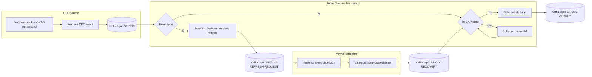

```mermaid

flowchart LR

    subgraph Source[CDCSource]
        A[Employee mutations 1-5 per second]
        B[Produce CDC event]
        A --> B
        B --> T1
    end

    T1[(Kafka topic SF-CDC)]

    subgraph Normalizer[Kafka Streams Normalizer]
        C{Event type}
        D{In GAP state}
        E[Gate and dedupe]
        F[Buffer per recordId]
        G[Mark IN_GAP and request refresh]
    end

    Treq[(Kafka topic SF-CDC-REFRESH-REQUEST)]
    O[(Kafka topic SF-CDC-OUTPUT)]

    subgraph Refresher[Async Refresher]
        H[Fetch full entity via REST]
        I[Compute cutoffLastModified]
    end

    Trec[(Kafka topic SF-CDC-RECOVERY)]

    T1 --> C

    C -- N --> D
    D -- No --> E --> O
    D -- Yes --> F

    C -- G --> G --> Treq

    Treq --> H --> I --> Trec

    Trec --> D
    F --> D


```