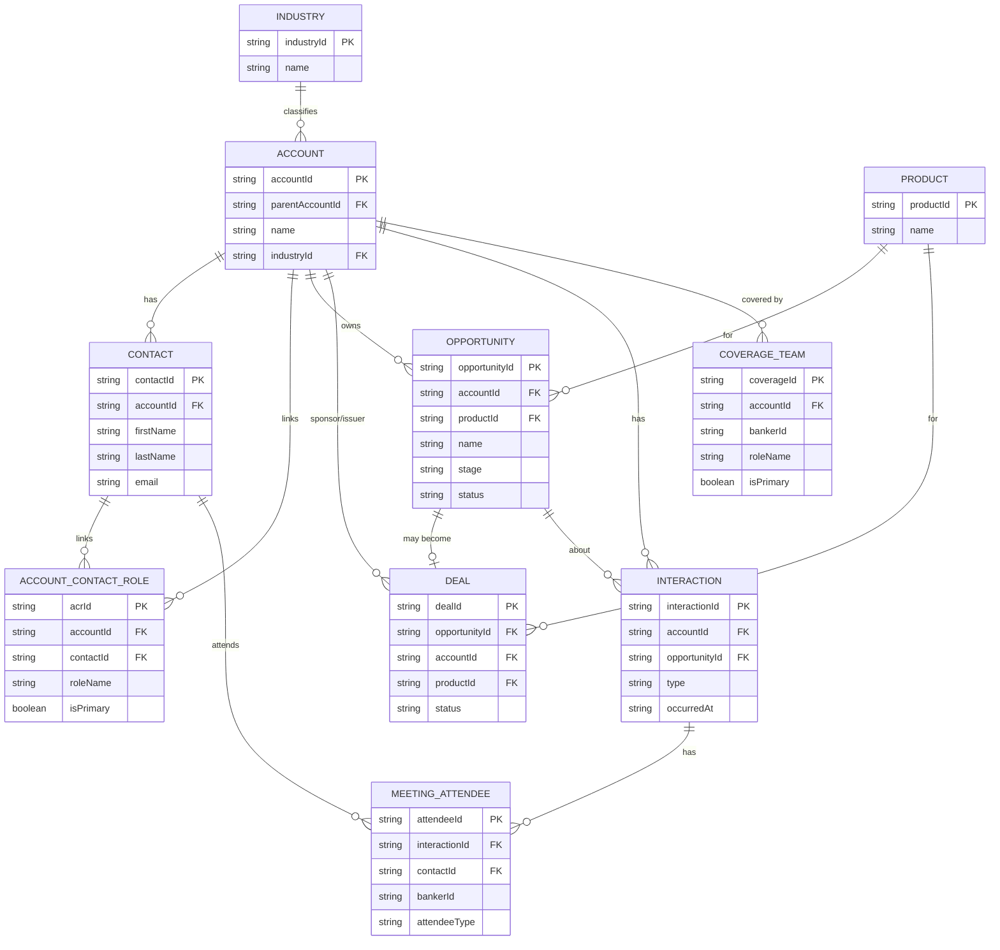

```mermaid
erDiagram

  ACCOUNT {
    string accountId PK
    string parentAccountId FK
    string name
    string industryId FK
  }

  CONTACT {
    string contactId PK
    string accountId FK
    string firstName
    string lastName
    string email
  }

  ACCOUNT_CONTACT_ROLE {
    string acrId PK
    string accountId FK
    string contactId FK
    string roleName
    boolean isPrimary
  }

  INDUSTRY {
    string industryId PK
    string name
  }

  PRODUCT {
    string productId PK
    string name
  }

  OPPORTUNITY {
    string opportunityId PK
    string accountId FK
    string productId FK
    string name
    string stage
    string status
  }

  DEAL {
    string dealId PK
    string opportunityId FK
    string accountId FK
    string productId FK
    string status
  }

  INTERACTION {
    string interactionId PK
    string accountId FK
    string opportunityId FK
    string type
    string occurredAt
  }

  MEETING_ATTENDEE {
    string attendeeId PK
    string interactionId FK
    string contactId FK
    string bankerId
    string attendeeType
  }

  COVERAGE_TEAM {
    string coverageId PK
    string accountId FK
    string bankerId
    string roleName
    boolean isPrimary
  }

  %% Relationships
  ACCOUNT ||--o{ CONTACT : "has"
  ACCOUNT ||--o{ ACCOUNT_CONTACT_ROLE : "links"
  CONTACT ||--o{ ACCOUNT_CONTACT_ROLE : "links"

  INDUSTRY ||--o{ ACCOUNT : "classifies"

  ACCOUNT ||--o{ OPPORTUNITY : "owns"
  PRODUCT ||--o{ OPPORTUNITY : "for"

  OPPORTUNITY ||--o| DEAL : "may become"
  ACCOUNT ||--o{ DEAL : "sponsor/issuer"
  PRODUCT ||--o{ DEAL : "for"

  ACCOUNT ||--o{ INTERACTION : "has"
  OPPORTUNITY ||--o{ INTERACTION : "about"

  INTERACTION ||--o{ MEETING_ATTENDEE : "has"
  CONTACT ||--o{ MEETING_ATTENDEE : "attends"

  ACCOUNT ||--o{ COVERAGE_TEAM : "covered by"

```