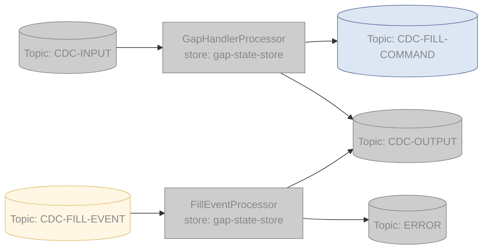
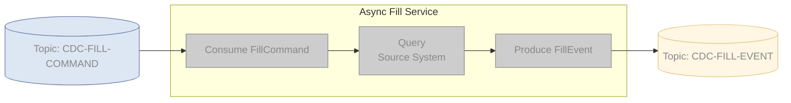

### Kafka Streams:  

- Service is single threaded, both GapHandlerProcessor & FillEventProcessor access _gap-state-store_.
  - _CDC-INPUT_ & _CDC-FILL-EVENT_ co-partitioned, keyed by CDC record id.
- Hot path is _CDC-INPUT_ > _GapHandlerProcessor_ > _CDC-OUTPUT_
- When _GapHandlerProcessor_ detects gap event:
  - Adds _GapEventState_ to _gap-state-store_, which is a buffer + meta-data, keyed by CDC record-id.
  - Subsequent CDC for the same record-id are buffered in _GapEventState_.
  - _FillCommand_ published for async processing.
- On _FillEvent_ the _FillEventProcessor_:
  - If the _FillEvent_ contains an error, publishes it to _ERROR_
  - If there is no corresponding buffer in the _gap_state_store_:
    - if the _FillEvent_ has a **force-flag** then publish to _CDC-OUTPUT_
    - else, drop the event (multiple deliveries of the event will result the same - idempotent)
  - Deletes GapEventState from the store.
- Periodically, _FillEventProcessor_ must also fail and pending _FillEvents_ if:
  - Too many subsequent CDC events have been buffered
  - Too much time has passed
  - [TODO: Punctuators for this]

Async 'FillService'
- Simple Kafka Consumer and Publisher
- Is a work queue so:
  - Turn auto-commit off, use Spring _Acknowledge_ param **after** FillEvent is sent
  - Non-transient errors are published as _FillEvents_ with failure status, to be handled by _FillEventProcessor_
  - On a transient error (e.g: Source system not available)
    - Spring _MessageListenerContainer_ can pause the Kafka subscription without causing rebalance.
    - Retry strategy until it works or crash after maxOutage time.
      - ack will not be sent on retry, _FillCommand_ will be processed twice, but Kafka is at-least-once anyway.
      - The _FillEventProcessor_ is idempotent anyway

