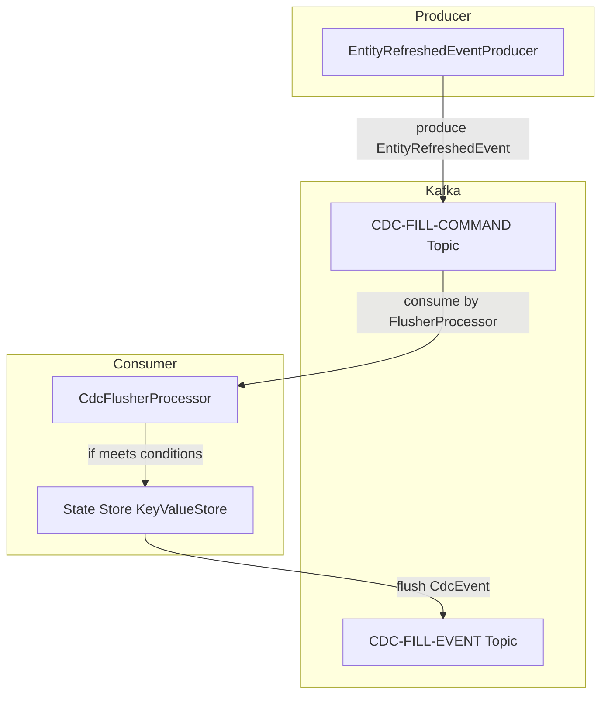
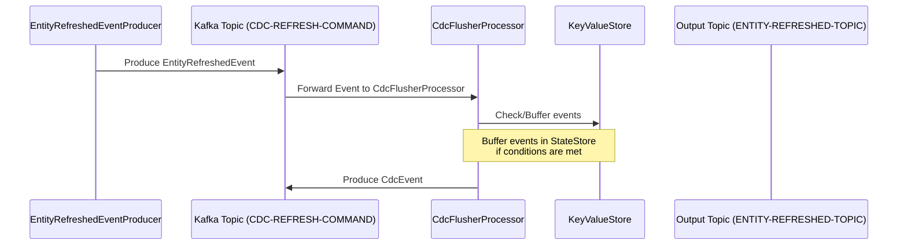

### kafka cdc

project for figuring out how to process compensatory events asynchronously

### Interaction Between Services Overview

---

#### **Sequence Diagram**

Alternatively, you could represent it with a sequence diagram to visualize the time-ordered interactions.

### Sequence of Events

---

### 3. **Where to Add/Modify in README**

1. **Heading Example**:
   Add a new heading below the existing sections (or replace outdated diagrams):